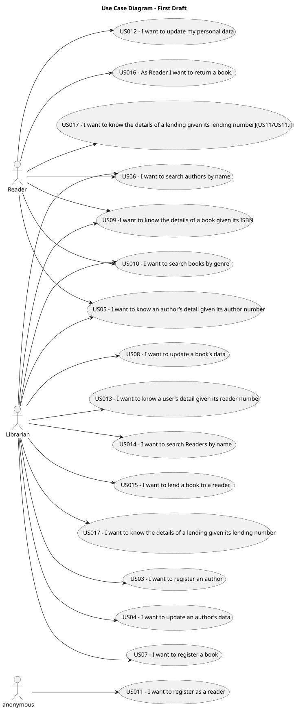

# Use Case Diagram (UCD)

__

# Use Cases / User Stories
| UC/US | Description                                                                                             |                   
|:------|:--------------------------------------------------------------------------------------------------------|
| US03  | [As Librarian I want to register an author](US03/US03.md)                                               |
| US04  | [As Librarian I want to update an author’s data](US04/US04.md)                                          |
| US05  | [As Librarian or Reader I want to know an author’s detail given its author number](US05/US05.md)        |
| US06  | [As Librarian or Reader I want to search authors by name](US06/US06.md)                                 |
| US07  | [As Librarian, I want to register a book](US07/US07.md)                                                 |
| US08  | [As Librarian I want to update a book’s data](US08/US08.md)                                             |
| US09  | [As Librarian or Reader I want to know the details of a book given its ISBN](US09/US09.md)              |
| US10  | [As Librarian or Reader I want to search books by genre](US10/US10.md)                                  |                             |
| US11  | [As anonymous I want to register as a reader](US11/US11.md)                                             |
| US12  | [As Reader I want to update my personal data](US12/US12.md)                                             |
| US13  | [As Librarian I want to know a user’s detail given its reader number](US13/US13.md)                     |                             |
| US14  | [As Librarian I want to search Readers by name](US14/US14.md)                                           |
| US15  | [As Librarian I want to lend a book to a reader.](US15/US15.md)                                         |
| US16  | [As Reader I want to return a book.](US16/US16.md)                                                      |                             |
| US17  | [As Reader or Librarian I want to know the details of a lending given its lending number](US17/US17.md) |

