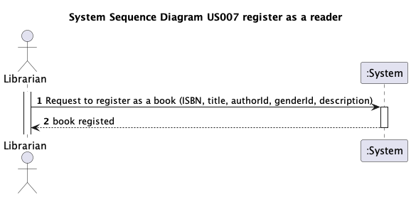
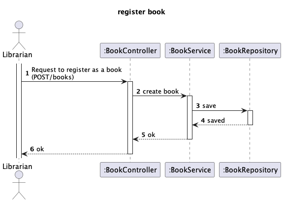

# US 07 - Register a book

## 1. Requirements Engineering

### 1.1. User Story Description

As librarian I want to register a book

### 1.2. Customer Specifications and Clarifications

>**Question:**
> Quais são os critério de aceitação (acceptance criteria) da us07?

>**Answer:**
> As Librarian, I want to register a book (isbn, title, genre, description, author(s))
se tentar registar um livro com um ISBN já existente deve ser indicado um erro
ISBN usamos o formato ISBN-10 ou ISBN-13
titulo do livro é obrigatório e não pode comecar ou terminar em espaços
descrição é opcional e deve suportar conteudo HTML
género e autor são obrigatórios
 

>**Question:**
> Quais são os critérios de aceitação da descrição ? Existe um número mínimo e/ou máximo de caractéres ? Em relação ao titulo do livro , apenas devem ser permitidas letras? Existem palavras proibidas?

>**Answer:**
>Quais são os critérios de aceitação da descrição ? Existe um número mínimo e/ou máximo de caractéres ?
maximo 4096 caracteres
Em relação ao titulo do livro , apenas devem ser permitidas letras? Existem palavras proibidas ?
pode conter qualquer caracter alfanumérico. não existem palavras proibidas

>**Question:**
> Um livro pode ter mais que um género?

>**Answer:**
> Apenas um género

>**Question:**
> Em relação ao ISBN , temos de validar o digito de verificação que faz parte da norma do ISBN-10 e 13?

>**Answer:**
> Sim

>**Question:**
> Os genres dos livros são uma lista dada pelo cliente, é o librarian que a faz e vai adicionando ou são atribuidos de uma outra forma?

>**Answer:**
> Os géneros de livros configurados na base de dados via bootstrapping

>**Question:**
> Podemos criar um livro com autores que ainda não foram criados? E estes autores deverão ser posteriormente guardados no sistema?

>**Answer:**
> Os autores devem ser criados previamente e depois selecionados aquando da criação do livro.

>**Question:**
> Em relação ao título, existe um número mínimo e/ou máximo de caracteres?

>**Answer:**
> máximo de 128 caracteres
  

### 1.3. Acceptance Criteria

- AC007:
  - se tentar registar um livro com um ISBN já existente deve ser indicado um erro
  - ISBN usamos o formato ISBN-10 ou ISBN-13
  - titulo do livro é obrigatório e não pode comecar ou terminar em espaços
  - descrição é opcional e deve suportar conteudo HTML
  - género e autor são obrigatórios
  - apenas deverá existir um género
  - os autores devem ser previamente criados
  - Descrição: máximo de 4096 caracteres
  - Título: máximo de 128 caracteres
  

### 1.4. Found out Dependencies

- Author class
- Genre class

### 1.5 Input and Output Data

**Input Data:**

- Typed data:

  - ISBN
  - Title
  - Description

- Selected data:
    - GenreId
    - AuthorId

**Output Data:**

- (In)success of the operation

### 1.6. System Sequence Diagram (SSD)

### 1.7 Other Relevant Remarks

- n/a

## 2. Design

### 2.1 Sequence Diagram (SD)

