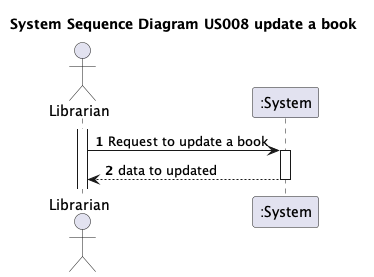
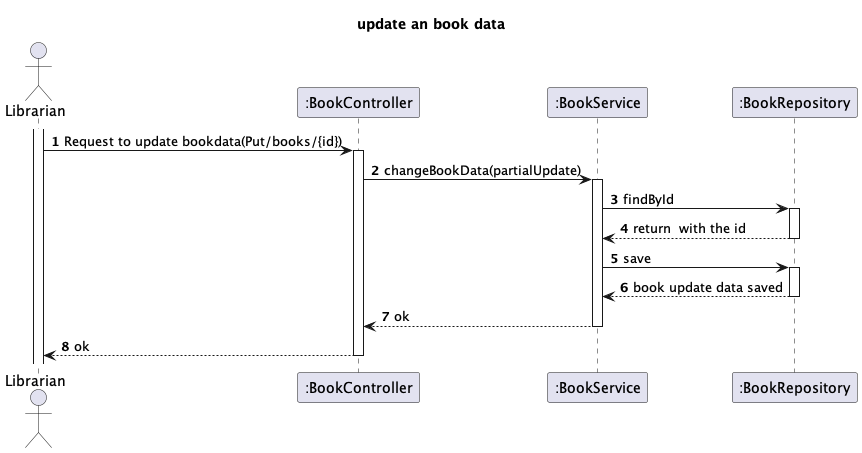

# US 08 - Update a book

## 1. Requirements Engineering

### 1.1. User Story Description

As librarian I want to update a book

### 1.2. Customer Specifications and Clarifications

>**Question:**
> Boa noite, qual o dado que precisamos de introduzir para proceder à atualização dos dados de um livro?

>**Answer:**
> à execção do ISBN todos os dados sao alteraveis

>**Question:**
> 

### 1.3. Acceptance Criteria

- AC008:
  - Podem alterar todos os dados do livro a exceção do isbn.
  - Deve ser possível “limpar” os dados não obrigatórios.

### 1.4. Found out Dependencies

- Author class
- Genre class

### 1.5 Input and Output Data

**Input Data:**

- Typed data:
  - Title
  - Description

- Selected data:
    - GenreId
    - AuthorId

**Output Data:**

- (In)success of the operation

### 1.6. System Sequence Diagram (SSD)

### 1.7 Other Relevant Remarks

- n/a

## 2. Design

### 2.1 Sequence Diagram (SD)

