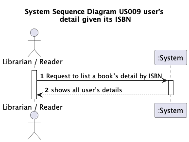
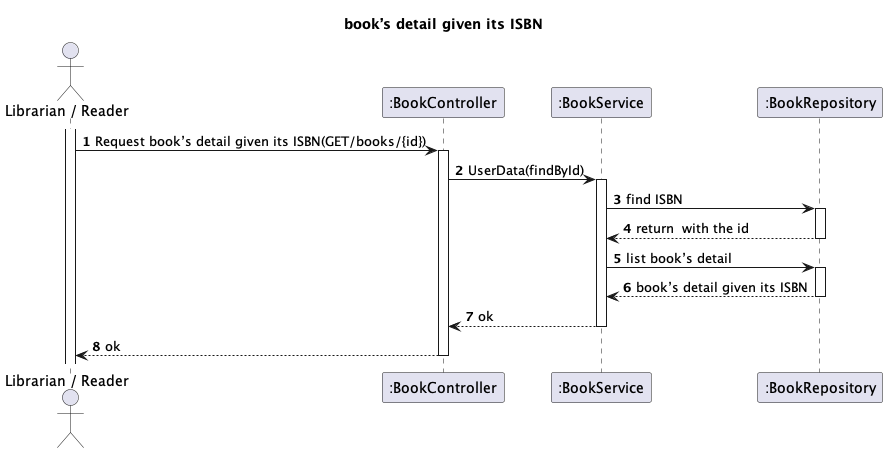

# US 09 - Search book

## 1. Requirements Engineering

### 1.1. User Story Description

As Librarian or Reader I want to know the details of a book given its ISBN

### 1.2. Customer Specifications and Clarifications

>**Question:**
> n/a

>**Answer:**
> n/a

### 1.3. Acceptance Criteria

- AC009:
  - devem ser mostrados todos os dados do livro (isbn, title, genre, description, author(s))

  

### 1.4. Found out Dependencies

- Author class
- Genre class

### 1.5 Input and Output Data

**Input Data:**

- Typed data:
  - n/a

- Selected data:
    - n/a
  
**Output Data:**

  - ISBN
  - Title
  - Description
  - GenderId
  - GenderDescription
  - AuthorId
  - AuthorName

### 1.6. System Sequence Diagram (SSD)

### 1.7 Other Relevant Remarks

- n/a

## 2. Design

### 2.1 Sequence Diagram (SD)

