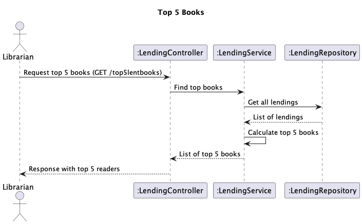

# US 11 - Top 5 Books Lent

## 1. Requirements Engineering

### 1.1. User Story Description

As Librarian I want to know the Top 5 books lent

### 1.2. Customer Specifications and Clarifications

- n/a

### 1.3. Acceptance Criteria

 - returns the list of the 5 books that have been lent the most in the last year. it must return for each book, the number of times the book has been lent. the result must be sorted descending order.

### 1.4. Found out Dependencies

- Tem que haver pelo menos 5 livros requesitados

### 1.5 Input and Output Data

**Input Data:**

- n/a

**Output Data:**

- Top 5 books
- (In)success of the operation

### 1.6. Sequence Diagram (SD)

### 1.7 Other Relevant Remarks

- n/a

