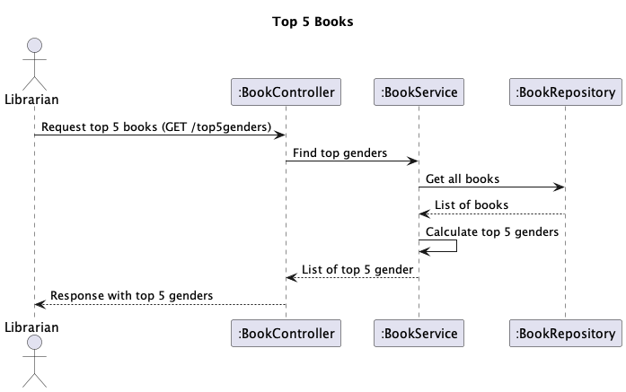

# US 11 - Top 5 Genders

## 1. Requirements Engineering

### 1.1. User Story Description

As Librarian I want to know the Top 5 genders

### 1.2. Customer Specifications and Clarifications

- n/a

### 1.3. Acceptance Criteria

 - Returns the 5 genres that the librarian possesses more books of. it must return the number of books per genre. the result must be sorted descending order 

### 1.4. Found out Dependencies

- Tem que haver pelo menos 5 generos

### 1.5 Input and Output Data

**Input Data:**

- n/a

**Output Data:**

- Top 5 genders
- (In)success of the operation

### 1.6. Sequence Diagram (SD)

### 1.7 Other Relevant Remarks

- n/a

