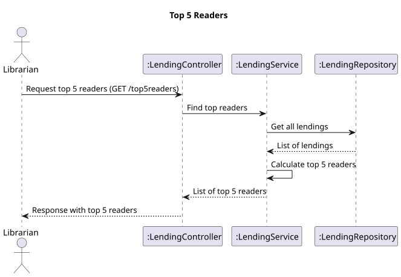

# US 11 - Top 5 readers

## 1. Requirements Engineering

### 1.1. User Story Description

As Librarian I want to know the Top 5 readers

### 1.2. Customer Specifications and Clarifications

- n/a

### 1.3. Acceptance Criteria

- n/a

### 1.4. Found out Dependencies

- Tem que haver pelo menos 5 users a requesitar livros

### 1.5 Input and Output Data

**Input Data:**

- n/a

**Output Data:**

- Top 5 readers
- (In)success of the operation

### 1.6. Sequence Diagram (SD)

### 1.7 Other Relevant Remarks

- n/a

